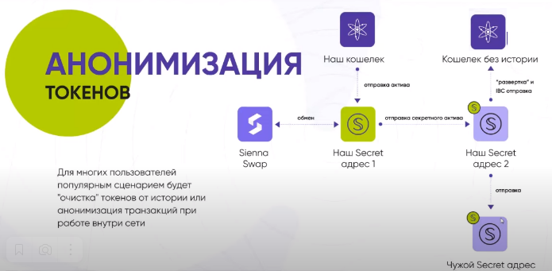

# Nomic

<figure><figcaption></figcaption></figure>

## Введение

**Nomic** - это сайдчейн биткоина Proof of Stake, основанный на протоколе консенсуса Tendermint. Его цель - обеспечить быструю циркуляцию и применение токенов, **привязанных к биткоину.** Эти токены обозначаются как **nBTC .** Сеть параллельна основной сети bitcoin-timechain, а nBTC можно обменять на BTC в соотношении 1:1.

**Безопасность** PoS-сети повышается за счет периодической синхронизации Nomic-sidechain с bitcoin-timechain: клиенты, синхронизирующиеся с сетью, всегда могут опираться на защиту Proof of Work при проверке согласованности блоков.

**Обновление Taproot** заложило основу для разработки биткоин-мультисиг-контракта для управления биткоин-мостом, участники которого представляют собой набор валидаторов.

## Управление резервом BTC 

Биткоин-резерв поддерживается с помощью контракта биткоин-мультисиг, где подписантами, контролирующими средства, являются все валидаторы сайдчейна.\
Право голоса каждого валидатора представлено в виде доли подписи в мультисиге.

📌В биткоин-сети до обновления Taproot было невозможно реализовать мультисиг с числом участников более 16. Теперь можно управлять биткоин-мультисигом, представляющим целый набор валидаторов (обычно > 64).

Условия расходования средств резерва обеспечиваются с помощью скрипта резерва.

#### Скрипт резерва 


Скрипт — это набор инструкций в Bitcoin. Скрипт управляет механизмом блокировки/разблокировки сейфов. Подробнее читайте [тут](https://academy.binance.com/ru/articles/an-introduction-to-bitcoin-script)


Скрипт работает следующим образом:

**Базовый сценарий**

Разрешает расходование средств, если более 2/3 валидаторов подпишут транзакцию. NOMIC называет это подмножество валидаторов **базовым набором**.

**Запасной сценарий**

Если условие 1 не выполняется, расходы будут разрешены посредством взвешенного мультисига, содержащего все открытые ключи подписантов и их право голоса. NOMIC называет это **запасным сценарием**.

Ожидается, что в большинстве случаев будет приниматься подпись базового набора: валидаторы PoS имеют высокое время безотказной работы. Тем не менее, сеть обратится к запасному сценарию, если:

* хотя бы один участник базового набора находится в автономном режиме;
* после тайм-аута базовый набор не завершил свою агрегированную подпись.

## Внесение BTC в резерв 

Чтобы вкладчики могли внести средства в резерв, они должны отправить bitcoin транзакцию в скрипт резерва, который модифицируется, чтобы содержать дополнительный скрипт, указывающий, куда в сайдчейне должны быть зачислены nBTC (эта схема депонирования называется _Script Path Commitment Scheme_). Вкладчики должны сами указать желаемый адрес назначения в Nomic.


_Обнаружение депозитов релеер-нодами_

_Вывод вышеуказанного скрипта резерва имеет уникальный хэш, т.к. адрес назначения в сайдчейне уникальный. Это означает, что у ретрансляторов могут возникнуть трудности в сопоставлении биткоин-транзакций с резервным скриптом. Чтобы решить эту проблему, релееры должны будут хранить адреса назначения сайдчейна, полученные от вкладчиков, и сопоставлять каждый вывод Taproot, который они видят в bitcoin транзакции, со всеми действующими в настоящее время сетами валидаторов и возможными адресами назначения._


#### Финализация депозита 

Чтобы избежать риска предоставления привязанных nBTC на Nomic-sidechain и одновременного возврата депозит-транзакции в сети bitcoin, система должна считать депозит окончательным только после его подтверждения на достаточной глубине bitcoin-timechain. Это достигается путем ожидания, времени, которое необходимо для добычи блоков, содержащих эквивалентное ожидающим депозитам количество BTC.

_Например, если на депозит внесено 8 BTC, а на блок в mainnet добывается 6,25 BTC, то ожидание 2 подтверждений является безопасной глубиной, так как затраты на изменение последовательности, скорее всего, будут больше чем прибыль от кражи депозита._

Общее количество BTC, ожидающих депозита, складывается из суммы всех индивидуальных сумм, находящихся в данный момент на депозите. Статусы отдельных вкладов переходят от "ожидает" к "окончательному" в порядке FIFO (первым пришел, первым ушел), где время подтверждения отдельных вкладов масштабируется по отношению к общему времени подтверждения.


_Например, общее количество 12 BTC вносится от 3 вкладчиков, 3 BTC, 5 BTC и 4 BTC соответственно в таком порядке; - вознаграждение за блок составляет 6,25 BTC. Тогда требуется подтверждение 2 блоков, почти 20 минут. 1-й депозит подтверждается через 5 минут (3/12\*20), 2-й депозит подтверждается через 8 минут 20 секунд (5/12\*20) и 3-й депозит подтверждается через 20 минут._


#### Спекуляции на депозитах 

Пользовательский опыт использования системы, основанной на вышеописанном консервативном подходе, хуже по сравнению с традиционными централизованными платформами (которые обычно ждут подтверждения 1-2 блока). Потому создан рынок транзакций-подтверждения. Вкладчик может продать эти токены неподтвержденного депозита трейдерам, у которых есть уверенность в том, что депозит в конечном итоге будет подтвержден. Токены будут торговаться по рыночной цене менее 1 nBTC.

Цена зависит от таких факторов, как оцениваемый риск, временная стоимость денег до подтверждения депозита и ликвидность на рынке неподтвержденных депозитов.

Вероятность подтверждения депозита оценивается с помощью таких данных, как наличие транзакции в мемпулах майнеров BTC, есть ли возможность применить к транзакции replace-by-fee, состояние хешрейта в сети, указывающее на вероятность реорганизации, инфу о вкладчике и т.д.


_replace-by-fee_ – это функция для изменения параметров отправки монет в мемпуле биткоина. Она позволяет заменить транзакцию на новую — с более высокой комиссией или другим адресом получателя.


### Возврат вклада и период разблокировки 

Может случиться так, что депозит-транзакция подтверждается слишком долго. Это может случиться если, например, устарел скрипт резерва из-за высокой нагрузки на блокчейн. Сайдчейн не может обработать такой депозит, так как подписавшие транзакцию участники уже недоступны или вовсе прекратили валидирование. Это приведет к потере средств.

Чтобы решить эту проблему, скрипт резерва модифицируется, чтобы сделать возможным для вкладчика забрать средства по истечении заданного времени или высоты блока. При этом в сайдчейне увеличивается период разблокировки.

#### **Возврат депозита** 

Поле `timelock`устанавливается на время или высоту блока, значительно превышающее время, необходимое для подтверждения транзакции депозита в Bitcoin, ретрансляции в сайдчейн, сборки и подтверждения в контрольной точке. Предполагается, что это может быть до 1 дня или 144 блоков. Заполнение этого поля остаётся на усмотрение вкладчика, но минимальное значение устанавливается чейном. Это сделано, чтобы предотвратить атаку типа «отказ в обслуживании», когда вкладчик возвращает депозит непосредственно перед тем, как релееры в сайдчейне начинают подтверждать поступление.

#### Период разблокировки 

Если депозит-транзакция отправлена, а набор валидаторов немного изменился до подтверждения, депозит все равно должен считаться действительным. Для того чтобы это обеспечить, период разблокировки в Nomic-sidechain будет значительно больше, чем время обработки deposit-транзакции.

## Выпуск BTC в сайдчейне: nBTC 

Как только релеер обнаруживает действительную депозит-транзакцию, он транслирует доказательство в Nomic-sidechain, содержащее:

* байты данных завершённой транзакции;
* байты адреса назначения в сайдчейне (при использовании _Script Path Commitment Scheme)_;
* хэш блока биткоина, содержащего транзакцию;
* ветвь Меркла, подтверждающую включение транзакции в блок.

Этих элементов достаточно, чтобы гарантировать событие депонирования BTC. После получения доказательства депонирования сайдчейн выпускает привязанные к биткоину nBTC и передаёт их по адресу назначения. nBTC могут быть переведены в сайдчейн, использованы в смарт-контрактах или сожжены при выводе средств из резерва обратно в bitcoin чейн.

#### Контрольные точки 

Периодически сеть будет совершать транзакции в биткоин-сети, называемые контрольными точками (checkpoint). Они оплачиваются из кошелька резерва и служат для:

* сбора депозитов;
* выплаты ожидающих снятия средств;
* обновление скрипта резерва для отражения последнего набора подписей;
* предоставление лайтнодам инструмента для проверки согласованности состояния между сетями;
* отмены предыдущей транзакции «экстренной выплаты».

Каждая контрольная точка состоит из трёх транзакций:

* транзакция сборки депозита (deposit collection tx);
* транзакция контрольной точки (checkpoint tx);
* транзакция выплаты (disbursal tx).

Депозиты собираются вместе в deposit collection-транзакцию, а незавершенные снятия объединяются в disbursal-транзакции, которые выплачивают средства на различные биткоин-адреса назначения.

Транзакция контрольной точки выполняется на основе последнего вывода сборки депозита и предыдущей транзакции контрольной точки. Она имеет следующую структуру:

**Ввод:**

* Резервный вывод предыдущей checkpoint-транзакции;
* Вывод предыдущей транзакции сборки депозита (если были депозиты).

**Вывод:**

* Резервный вывод, равный количеству Биткойнов, которые должны храниться в резерве. Выводится в обновленный скрипт резерва, основанный на последнем наборе подписей;
* Если есть ожидающиеся выводы средств, то формируется вывод количества биткойнов, которые должны быть выплачены. Также выводится в обновленный скрипт резерва, основанный на последнем наборе подписей.

#### Интервалы создания контрольной точки 

Контрольная точка создаётся каждый раз, когда меняется набор подписей, либо с определенным интервалом. Одна контрольная точка на каждый блок биткоина является идеальным вариантом.

#### Предотвращение long-range атак PoS 

Известной проблемой сетей proof-of-stake является так называемая **long-range** атака, когда валидатор форкает сеть с достаточно давно созданного общего блока, а после атаки, воспроизводит альтернативную сеть без "ненужных блоков" и риска быть наказанным сжиганием своих застейканных токенов. Таким образом злоумышленник обманет клиентов, синхронизировавшихся с его "фальшивой" сетью.

Что такое Long-range атака

Михаил (М) хочет атаковать сеть. Для этого он исключает блоки Василия (В) и Анфисы (А). Исключённые блоки изображены в скобках, вверху форк жулика, который идёт параллельно основной последовательности блоков (внизу).

Но для того, чтобы высота блоков соответствовала основной сети, М приходится вычислять блоки заранее (пропущенные блоки обозначены точками), таким образом М целиком воспроизводит альтернативу истинной последовательности и позже, когда нужные блоки удалены, в форке выпускаются такие же блоки как и в основном чейне, атака завершается.

.png>)

Подробное описание long-range атак [здесь](https://blog.positive.com/rewriting-history-a-brief-introduction-to-long-range-attacks-54e473acdba9)

Контрольные точки в bitcoin сети позволяют предотвратить long-range атаки, следуя сети контрольных точек:

1. клиент убеждается, что заголовок блоков биткоина находится в самом высоком блоке;
2. с помощью checkpoint-транзакции и его merkle-ветви он убеждается, что она включена в блок биткоина;
3. клиент проверяет согласованность между текущей и предыдущей контрольными точками.

## Релееры 

Каждый раз, когда добывается новый блок биткоина или в сеть биткоина транслируется депозит-транзакция, эти данные должны быть перенесены в Nomic-sidechain. И наоборот, когда подписывается транзакция, данные о ней необходимо передать в сеть биткоина. Эту работу выполняют **ноды-ретрансляторы (релееры)**: узлы, смотрящие в обе сети. Они постоянно сканируют сети биткоина и Nomic и передают соответствующие данные.

Нода-ретранслятор выполняет ретрансляцию:

**Bitcoin в Nomic:**

* депозит-транзакция и ветвь Меркла, доказывающую, что она была включена в блок биткоина;
* заголовок блока, когда добыт очередной.

**Nomic - Bitcoin:**

* транзакцию контрольной точки.

## Безопасность 

Cайдчейн может содержать большие резервы биткойнов. В отличие от протоколов на одном блокчейне, инцидент, приведший к потере средств в сайдчейне, приведёт к потере биткойнов. Кроме того, если более 2/3 подписантов захотят украсть резерв, они смогут это сделать.

По этой причине:

* устанавливается **экстренная выплата**, защищающая от сбоев в работе;
* подписывающие транзакции блокируют свои $NOM, это гарантирует, что они лишены экономического стимула разворовать резерв.

Наряду с хорошо известными правилами [слэшинга](https://www.cosmobook.io/cosmobook/v/russian/readme/cosmoshub#sleshing) в сетях PoS, подписанты также подвергаются ему, когда обнаруживается, что некоторые из них подписали транзакцию расхода резерва, а остальные валидаторы не подписали.

## Генерация токена 

Существует множество вариантов определения того, как токен стейкинга попадает в обращение. Для поддержания справедливого и децентрализованного распределения, например, токены могут быть отчеканены на основе предоставленного доказательства сожжения BTC, или майнерам Биткоина в качестве вторичной награды за блок.

## Обеспечение BTC 

Подписавшие должны иметь избыточное обеспечение по отношению к количеству BTC-резерва, которым они управляют. Минимальное значение коэффициента обеспечения установлено на уровне 1.5, то есть сговор более 2/3 валидаторов для кражи BTC-резерва, пройдёт с потерей всего внесенного ими залога.

<figure><figcaption></figcaption></figure>

Однако, эта стратегия неэффективна с точки зрения капитала, для хранения 1 миллиона, подписанты должны заблокировать 1.5, поэтому применяется дополнительное вознаграждение за стейкинг **ставка резерва.**

Комиссии взимаются со всех счетов, имеющих nBTC. Таким образом, залоговое обеспечение растет пропорционально депозитам BTC.

Возможны различные поддержания коэффициента:

* _регулирование резервной ставки_ в зависимости от коэффициента залога (когда он падает, доходы увеличиваются);
* _фиксированная норма резервирования_. Когда коэффициент обеспечения падает ниже целевого значения, запросы на выплату BTC будут сокращены путем принудительной выплаты, с приоритетом для более высокой ставки.\
  Консервативный подход заключается в том, чтобы установить целевой показатель коэффициента обеспечения > 1.5.

### Экстренные выплаты 

Для защиты в случае длительного сбоя сети, подписывающие включают в процесс контрольной точки подписи для экстренного вывода средств (emergency disbursal-транзакция), которые выплатят по каждому требованию BTC. Эта транзакция имеет блокировку по времени на 2 недели. Если в течение этого периода не будет произведена транзакция контрольной точки (каждый раз, когда производится checkpoint, экстренная транзакция задерживается на 2 недели).

Валидаторы сделают все, что в их силах, чтобы предотвратить длительные периоды сбоя работоспособности и экстренной выплаты, поскольку, если это произойдет, токены, размещенные в sidechane, не будут иметь никакой ценности и будут эквивалентны слэшу всей сети.

Возможно создание вторичного рынка, где трейдеры могут спекулировать на вероятности возникновения экстренной выплаты, которая служит индикатором для остальной части сети, измеряя риски катастрофического сбоя.

## Запуск сети 

Для запуска Nomic сеть будет разворачиваться поэтапно в течение ближайших месяцев.

### Фаза 1: Stakenet (февраль 2022, завершена) 

Stakenet запускает сеть, выпуская токен NOM через airdrop для держателей ATOM и стейкеров, позволяя им стейкать NOM и начинать накапливать вознаграждения. Функциональность моста и передача токенов NOM на этом этапе отключены, что позволяет запустить сеть контролируемым способом, где влияние потенциальных проблем сведено к минимуму.

### Фаза 2: Модернизация IBC 

Первое обновление сети соединит Nomic с другими сетями Cosmos (через IBC) и с блокчейном Bitcoin (через протокол моста). Это станет значимой вехой для экосистемы Cosmos, поскольку Nomic будет первой IBC-сетью, не основанной на Cosmos SDK, а блокчейн Bitcoin официально станет частью The Interchain.

Переводы токенов NOM также будут доступны на этом этапе (как локально, так и через IBC) - однако, nBTC по-прежнему не будут доступны для ввода или вывода средств.

### Фаза 3: Работающий Bitcoin Bridge 

В этом обновлении сеть полностью включит Bitcoin Bridge, что позволит всем желающим вносить BTC в обмен на nBTC и выводить nBTC в обмен на BTC. nBTC также будут доступны для перемещения через IBC, поэтому на данный момент ожидается, что BTC будут мгновенно использоваться в пулах Osmosis и других протоколах.

### Новые функции Bitcoin

Активированы **5 июля в 18:00 UTC**, и и с этого момента в приложении Nomic видны вознаграждения в Bitcoin .

Некоторые интересные функций безопасности Биткоин-моста (например, [экстренные выплаты](nomic.md#y8pa)) не включены в этот релиз и будут добавлены позже в течение нескольких следующих обновлений. Эти функции безопасности станут ключевыми отличиями между Nomic и другими мостами.

## Airdrop

### Airdrop 1.

_**Условия:**_

Держатели/стейкеры АТОМ с балансом не менее 1,5 АТОМ.

Снимок: Космос блок 9,150,000 (21 янв 2022 в 11:22:43 UTC)_._

**Распространение:**

* Общая сумма: 3,500,000 NОМ
* Формула: `(min(liquidBalance, 1000) + (4 * min(stakedBalance, 1000))) / 20.299325` (Ограничение в 1000 АТОМ как на ликвидный баланс, так и на баланс стейкинга, с 4-кратным множителем на баланс стейкинга).
* Разлок: линейный разлок, начинающийся через 1 месяц после запуска nBTC

**Принять участие в дропе и начать стейкать NOM можно в веб-приложении Nomic:** [**https://app.nomic.io**](https://app.nomic.io/) (требуется расширение Keplr Chrome).

### Airdrop **2.**

_**Условия:**_

\- стейкеры $ATOM, $OSMO, $JUNO, $EVMOS, $KUJI

\- Стейкинг валидаторам вне Top20.&#x20;

Снимок сделан 27 сентября 2022.

Объем эйрдропа 3.5M $NOM&#x20;

&#x20;Лимит: максимум 10 тысяч токенов на сеть, на один кошелек.

Стимулируемый тестнет разблокирует 25% от основной сети NOM Airdrop

Airdrop 2 можно  получить участникам тестнета, выполнив 4 миссии.&#x20;

Видео, как выполнить мисси [тут.](https://www.youtube.com/watch?v=ORz\_PLfhF5A)

Под эйрдроп попало более 209к кошельков.

Проверить свой кошелёк можно [тут](https://testnet.nomic.io/#/airdrop).

### Airdrop **3.**

Детали этого выпуска пока не уточняются и будут включены в предстоящие обновления сети. До тех пор эти токены зарезервированы, но не находятся в обращении.

## Токеномика 

Токен NOM используется для обеспечения безопасности сети Nomic.

Распределение NOM смоделировано по образцу токена OSMO. Сеть начала работу с запасом в 21 000 000 NOM, а максимальный запас после 9 лет инфляции составит 210 000 000 NOM (как дань уважения 21 000 000 BTC Биткоина).

#### Первоначальное распределение**:** 

**Итого:** 21,000,000 NOM

**Airdrop I** - 3,500,000 NOM

**Airdrop II** - 3,500,000 NOM

**Airdrop III** - 3,500,000 NOM

**Стратегический резерв** - 10,500,000 NОМ

Основанный на стандартах $OSMO и других проектов Cosmos, стратегический резерв используется для создания стратегических партнерств для Nomic. Он хранится в мультисиге у директоров Nomic DAO Foundation и предназначен строго для достижения долгосрочных целей Nomic. Он не будет использоваться для продажи на рынке, а для стратегических партнеров будут установлены сроки наделения правами. Все средства, полученные из стратегического резерва, будут использованы для финансирования усилий Nomic по развитию.

По усмотрению членов multisig резерв также может быть использован для делегирования полномочий валидаторам, которые оказывают услуги Nomic, например, управляют инфраструктурой, такой как блокчейн-эксплореры и ретрансляторы, или предоставляют инструменты/ресурсы с открытым исходным кодом для экосистемы. В целях поддержания децентрализации сети стратегический резерв не будет "перехватывать" контрольную долю сети.

**Всего распределено после запуска:** 189,000,000 NOM

NOM будет распределяться в течение 9 лет, уменьшая уровень инфляции на 1/3 каждый год.

* **Вознаграждение за стейкинг** - 47,250,000 NOM

Вознаграждения будут распределяться среди валидаторов и делегатов NOM аналогично другим сетям Cosmos.

* **Протокольные стимулы** - 85,050,000 NОМ

Эта доля предложения NOM будет использоваться для будущих стимулов, которые будут определены руководством или предложены в последующих обновлениях. Например, потенциальные стимулы могут быть выплачены держателям nBTC или поставщикам ликвидности для пулов NOM или nBTC на Osmosis.

Поскольку во время запуска Stakenet не будет действовать никаких протокольных стимулов, выпущенный NOM будет накапливаться в пуле для последующего распределения.

* **Наделение правами разработчика** - 47,250,000 NОМ

Доля разработчика будет со временем распределяться среди команды Nomic. Обратите внимание, что поскольку сеть децентрализована, в случае, если команда Nomic перестанет вносить основной вклад в разработку, доля разработчика может быть перенаправлена для наделения других команд или отдельных лиц.

* **Общий пул** - 9,450,000 NОМ

Часть NOM будет собираться в пул, который может быть потрачен руководством сети. Фаза Stakenet не будет включает механизм расходования этих средств, поэтому они будут накапливаться до более позднего обновления, которое добавит систему управления.

## Долгосрочное видение 

Nomic разрабатывается с 2018 года первыми сотрудниками Cosmos, и хотя на первый взгляд он во многом похож на другие сети Cosmos, у него принципиально другая ДНК. Другие сети основаны на Cosmos SDK, стандартном фреймворке, который имеет много достоинств, но также и свои недостатки. Nomic использует Tendermint consensus, но в остальном построен на полностью [собственном стеке](https://github.com/nomic-io/orga), написанном на языке Rust, с упором на производительность и возможность быстро разрабатывать новые функции.

Настоящим долгосрочным фокусом Nomic является создание инновационных DAO, которые, по мнению Nomic, являются самой важной новой идеей в криптовалютном пространстве с потенциалом, который еще предстоит раскрыть.

### Полезные ссылки

🔗 Сайт: [https://nomic.io](https://nomic.io)\
🔗 Приложение: [https://app.nomic.io](https://app.nomic.io)\
🔗 Telegram: [https://t.me/nomicbtc](https://t.me/nomicbtc)\
🔗 Twitter: [https://twitter.com/nomicbtc](https://twitter.com/nomicbtc)\
🔗 Discord: [https://discord.gg/7FjMJ49Vbc](https://discord.gg/7FjMJ49Vbc)\
🔗 Блог: [https://blog.nomic.io/](https://blog.nomic.io/)\
🔗 GitHub: [https://github.com/nomic-io](https://github.com/nomic-io)\
🔗 Explorer: [http://nomic.zenscan.io/index.php](http://nomic.zenscan.io/index.php)

🌍 Сообщество

🇮🇹 [https://t.me/nomicita](https://t.me/nomicita)\
🇷🇺 [https://t.me/nomicbtc\_ru](https://t.me/nomicbtc\_ru)
